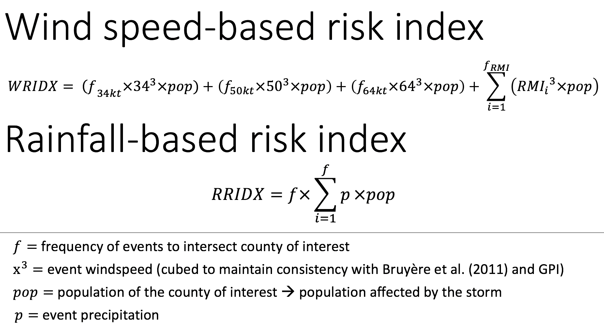
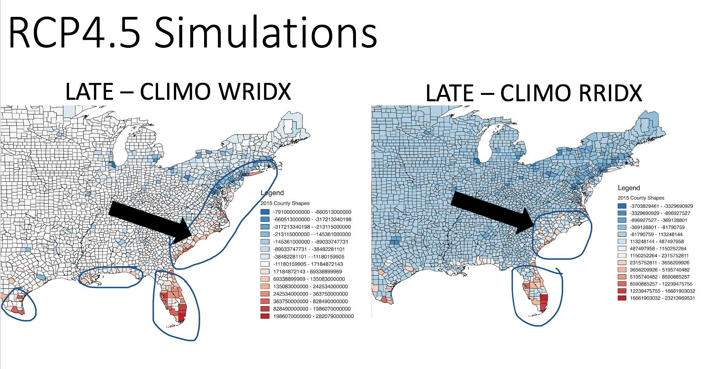

# risk-index
### creating a county level hurricane risk index using observed hurricane landfall frequencies, population data, maximum intensity, and precipitation

The formula for hurricane risk is as follows:

Results comparing risk between a late 21st century model and current climate model:

# Source data and code

Source Code and Data 

GIS shapefiles for United States Counties: https://nhgis.org

GFDL HiFLOR model source code available: https://www.gfdl.noaa.gov/cm2-5-and-flor/
HURDAT2 data: http://www.aoml.noaa.gov/hrd/hurdat/Data_Storm.html

https://census.gov for decennial census for counties (accessed through Social Explorer)

PDO Index
http://research.jisao.washington.edu/pdo/
ENSO Index
http://www.cpc.ncep.noaa.gov/data/indices/sstoi.indices
AMO Index
https://www.esrl.noaa.gov/psd/data/correlation/amon.us.data
AMM Index
https://www.esrl.noaa.gov/psd/data/timeseries/monthly/AMM/ammsst.data

State Population Projections
01	ALABAMA   2020-2040 county estimates every 5 years (2025)
https://cber.cba.ua.edu/edata/est_prj.html

05	ARKANSAS	2014-2065 county estimates every year (2025 and 2060)
https://ualr.edu/aedi/demographic-research/population-projections-county/

04	ARIZONA	2015-2050 county estimates every year (2025)
https://population.az.gov/population-projections

06	CALIFORNIA   2020-2060 county estimates every year (2025)
Need to use this website: http://www.dof.ca.gov/Forecasting/Demographics/Projections/

09	CONNECTICUT  2015-2040 every year (2025)
https://ctsdc.uconn.edu/2015_2025_projections/

11	DISTRICT OF COLUMBIA 2015-2045 every 5 years (2025)
https://planning.dc.gov/sites/default/files/dc/sites/op/publication/attachments/Forecasting%20DC%20Growth%202015-2045%20-%20Results%20and%20Methodology%20-%20FINAL_011217.pdf

10	DELAWARE	2010-2050 every 5 years (2025)
https://stateplanning.delaware.gov/information/dpc/DPC2017v0.pdf

12	FLORIDA 2020-2045 every 5 years (2025)
	https://www.bebr.ufl.edu/population/population-data/projections-florida-population-county-2020%E2%80%932045-estimates-2016

13	GEORGIA	2013-2050 every year (2025)
https://opb.georgia.gov/population-projections

21	KENTUCKY	2010-2040 every 5 years (2025) google
http://ksdc.louisville.edu/data-downloads/projections/

22	LOUISIANA	2010-2030 every 5 years parish/county (2025)
http://louisiana.gov/Explore/Population_Projections/

25	MASSACHUSETTS
http://pep.donahue-institute.org/

24	MARYLAND   2010-2045 every 5 years (2025)
http://planning.maryland.gov/MSDC/Pages/s3_projection.aspx

23	MAINE	2014-2034 every 5 years 2024 (2025)
https://www.maine.gov/dafs/economist/demographic-projections

28	MISSISSIPPI
http://www.mississippi.edu/urc/downloads/PopProjections/PopulationProjections.pdf

37	NORTH CAROLINA
https://www.osbm.nc.gov/demog/county-projections

33	NEW HAMPSHIRE
https://www.nh.gov/osi/data-center/population-projections.htm

34	NEW JERSEY
https://www.nj.gov/labor/lpa/dmograph/lfproj/lfproj_index.html

32	NEVADA
http://nvdemography.org/wp-content/uploads/2014/10/Nevada-Population-Projections-2014-Full-Document.pdf

36	NEW YORK
https://pad.human.cornell.edu/counties/projections.cfm

39	OHIO
https://development.ohio.gov/reports/reports_pop_proj_map.htm

42	PENNSYLVANIA
https://pasdc.hbg.psu.edu/Data/Projections/tabid/1013/Default.aspx

44	RHODE ISLAND
BASED ON CENSUS PROJECTIONS

45	SOUTH CAROLINA
http://sccommunityprofiles.org/census/proj2025.html

47	TENNESSEE
http://tndata.utk.edu/sdcpopulationprojections.htm

48	TEXAS
http://txsdc.utsa.edu/Data/TPEPP/Projections/

51	VIRGINIA
https://demographics.coopercenter.org/virginia-population-projections

50	VERMONT
https://addisoncountyedc.org/uploads/documents/VermontPopulationProjections2010_2030%201.pdf

54	WEST VIRGINIA
http://busecon.wvu.edu/bber/pdfs/BBER-2014-04.pdf
